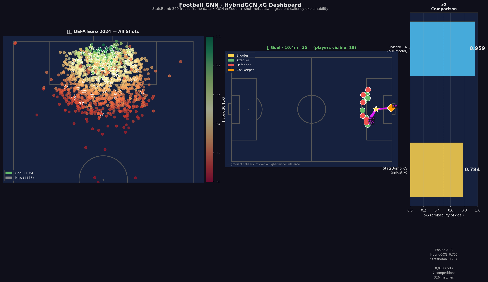
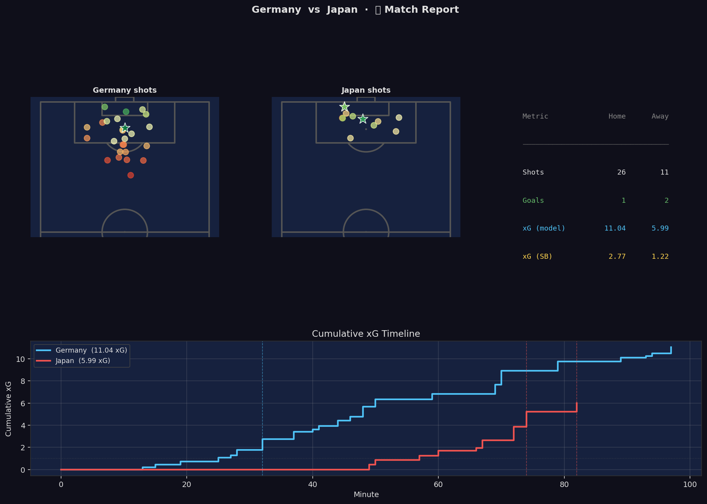

# football-analysis

Graph Neural Network (GNN) research applied to football (soccer). Players are modeled as nodes, their spatial interactions and passes as edges — enabling models to reason about team shape, pressing traps, and off-ball movement as relational structures.



> **HybridGAT+T achieves AUC 0.760 · Brier 0.148** on 8,013 shots across 7 StatsBomb 360 competitions — trained with 27-dim metadata including PSxG shot placement, GK positioning, defensive blocking, and foot preference. Per-competition temperature scaling applied. Reaches **95.7% of StatsBomb's proprietary xG AUC** using only free, open data.

> 🎯 **Publication in progress** — targeting MIT Sloan Sports Analytics Conference. Five novel contributions confirmed against existing literature: GATv2 hybrid xG on freeze-frames, temperature scaling for xG, geometric GK features, cross-gender multi-competition evaluation, and permutation importance on GNN xG.

---

### 📋 Match Report



The **Match Report** tab delivers a full per-match breakdown: side-by-side home/away shot maps coloured by HybridGAT xG, a KPI table (shots, goals, model xG, StatsBomb xG), and a cumulative xG step-function timeline with goal markers — select any match from any of the 7 competitions in the sidebar.

### 🔍 Feature Importance


The **Feature Importance** tab shows permutation importance across 12 feature groups: shuffling each group on the validation set and measuring AUC degradation. GK distance dominates (+0.223 AUC drop), followed by shot distance (+0.070) and header flag (+0.060). Pre-computed results load instantly with no re-inference needed.

### Dashboard tabs

| Tab | What it shows |
|---|---|
| 📍 **Shot Map** | Half-pitch heat map of all shots coloured by HybridGAT xG; filter by outcome (goals/misses) or team; team KPI card; top-10 xG list; most surprising goals sidebar |
| 🔬 **Shot Inspector** | Full freeze-frame of every visible player at shot moment; gradient-saliency overlay (which players influenced the GCN most) or GAT attention overlay (top-3 player pairs attended to); xG comparison bar |
| 📊 **xG Distributions** | Goal vs miss histograms; reliability diagram (calibration curve); Brier score comparison table |
| 📋 **Match Report** | 4-panel report: home/away shot maps, KPI text, cumulative xG timeline; analyst narrative with executive summary and shot-by-shot log |
| 🌟 **Surprise Goals** | Goals rated < 15% xG by the model — worldies, deflections, and individual brilliance; ranked pitch map + table with player/team/minute |
| 👤 **Player Profile** | Per-player shots/goals/xG/overperformance aggregated across the competition; scatter of Goals vs xG; sortable/filterable table; CSV download |
| 🔍 **Feature Importance** | Permutation importance bar chart across 12 metadata groups + ranked impact table; pre-computed from `feature_importance.json` |

## Goal

Build a pipeline from raw football data → spatial graphs → GNN models that can:
- Predict pass completion from spatial freeze-frames
- Classify which team is in possession from formation shape alone
- Detect pressing traps as subgraph patterns
- Value off-ball movement through graph attention

## Repo Structure

```
football-analysis/
├── data/
│   ├── raw/           # Downloaded datasets (gitignored)
│   └── processed/     # Graph objects (.pt) + model weights + plots (gitignored)
│
├── notebooks/
│   ├── 01_eda/                  # Data exploration
│   ├── 02_graph_construction/   # Events/tracking → graph objects
│   └── 03_gnn_experiments/      # Model training & evaluation
│
├── assets/
│   ├── dashboard_hero.png          # README hero screenshot
│   ├── match_report_screenshot.png # Match report tab screenshot
│   ├── feature_importance.png      # Permutation importance bar chart (RQ5)
│   ├── fig_graph_construction.png  # Fig 1: freeze-frame → graph pipeline (paper)
│   ├── fig_architecture.png        # Fig 2: HybridGATv2 block diagram (paper)
│   └── fig_reliability.png         # Fig 3: reliability diagram (calibration curve)
│
├── scripts/
│   ├── download_data.py            # Download Metrica CSV files from GitHub
│   ├── build_graphs.py             # Metrica tracking → PyG graph datasets
│   ├── build_statsbomb_graphs.py   # StatsBomb 360 → pass-completion graphs
│   ├── build_shot_graphs.py        # StatsBomb 360 → xG shot graphs (with shot_placement + comp_label)
│   ├── train_team_classifier.py    # Experiment 1 & 2: which team is passing?
│   ├── train_statsbomb_classifier.py  # Experiment 3 & 4: pass completion
│   ├── train_xg_model.py           # Experiment 5 & 6: GCN/GAT xG vs baselines
│   ├── train_xg_hybrid.py          # Experiment 7–10: HybridGAT+T, 27-dim meta, per-comp T
│   ├── feature_importance.py       # Permutation importance across 12 metadata groups
│   ├── lr_baseline.py              # Metadata-only LR baselines (4d / 12d / 27d)
│   ├── ablation_rq123.py           # RQ1-3 ablation: LR vs GCN vs HybridGAT+T + bootstrap CIs
│   └── upload_to_hub.py            # Upload model weights to HuggingFace Hub
│
├── src/
│   ├── graph_builder.py   # Core: events/tracking → PyG Data objects
│   ├── features.py        # Node and edge feature engineering
│   └── models/            # GNN architectures (GCN, GAT)
│
└── legacy/            # Earlier visualization and scraping work
    ├── statsbomb/
    ├── fbref/
    └── devinpueler/
```

## Data Sources

| Dataset | Type | Graphs Built | License | Link |
|---|---|---|---|---|
| StatsBomb Open Data (360) | Events + freeze-frames | ~115K pass + 8,013 shot (326 matches, 7 comps) | Non-commercial | [github.com/statsbomb/open-data](https://github.com/statsbomb/open-data) |
| Metrica Sports | Full optical tracking (25Hz) | 1,763 (2 matches) | MIT | [github.com/metrica-sports/sample-data](https://github.com/metrica-sports/sample-data) |
| SkillCorner Open | Broadcast tracking (~10Hz) | — | CC BY-SA 4.0 | [github.com/SkillCorner/opendata](https://github.com/SkillCorner/opendata) |

**StatsBomb 360 competitions used:**

| Competition | Season | comp_id | season_id | Matches | Shot graphs | Goal % |
|---|---|---|---|---|---|---|
| FIFA World Cup | 2022 | 43 | 106 | 64 | 1,412 | 11.6% |
| Women's World Cup | 2023 | 72 | 107 | 64 | 1,589 | 9.4% |
| UEFA Euro | 2020 | 55 | 43 | 51 | 1,215 | 10.6% |
| UEFA Euro | 2024 | 55 | 282 | 51 | 1,279 | 8.3% |
| 1. Bundesliga | 2023/24 | 9 | 281 | 34 | 887 | 11.8% |
| UEFA Women's Euro | 2022 | 53 | 106 | 31 | 785 | 10.3% |
| UEFA Women's Euro | 2025 | 53 | 315 | 31 | 846 | 11.9% |
| **Total** | | | | **326** | **8,013** | **10.4%** |

## GNN Formulation

```
G = (V, E, X_node, X_edge)

V  players visible on pitch at moment t (freeze-frame or tracking snapshot)
   node features: [x, y, teammate, actor, keeper,
                   dist_atk_goal, dist_def_goal, angle_atk, pressure]

E  Delaunay triangulation of player positions
   edge features: [distance, Δx, Δy, same_team, pass_angle, vel_alignment]

y  pass_completion (0=complete, 1=failed)  ← StatsBomb experiments
   possession_team (0=home, 1=away)        ← Metrica experiments
```

## Results

### Experiment 1 — Team Classifier (Metrica, in-game)

**Task:** Predict which team is making the pass (Home / Away) from spatial structure alone — team identity deliberately excluded from node features.

**Data:** 799 pass graphs · Metrica Sample Game 1 · 437 Home / 362 Away · 70/15/15 chronological split

| Model | Test Acc | Test AUC | Params |
|---|---|---|---|
| GCN (3-layer, hidden=64) | 0.868 | 0.998 | 11,009 |
| **GAT (3-layer, 4 heads, edge features)** | **1.000** | **1.000** | 46,433 |

**Takeaway:** GAT perfectly separates formations through edge attention (velocity alignment, pass direction). GCN reaches 86.8% with graph topology alone — both well above the 54.7% majority baseline.

---

### Experiment 2 — Cross-Match Generalization (Metrica Game 1 → Game 2)

**Task:** Same team classifier, but trained on Game 1 and tested on a completely held-out Game 2.

**Data:** Train 799 graphs (Game 1) · Test 964 graphs (Game 2)

| Model | Test Acc | Test AUC |
|---|---|---|
| **GCN** | **0.992** | **1.000** |
| GAT | 0.940 | 1.000 |

**Takeaway:** GCN generalizes *better* than GAT across matches — a classic bias-variance reversal. GAT's edge attention overfits to Game 1's specific patterns; GCN's simpler aggregation transfers more robustly.

---

### Experiment 3 — Pass Completion Classifier (StatsBomb WC2022, in-competition)

**Task:** Given the spatial freeze-frame at a pass event, predict whether the pass succeeds (label 0) or fails (label 1). 80/20 class imbalance handled with weighted BCE loss.

**Data:** 4,152 graphs · 5 WC2022 matches · 79.9% complete · 70/15/15 chronological split

| Model | Test Acc | Test AUC | Macro F1 |
|---|---|---|---|
| **GCN** | 0.685 | **0.609** | **0.602** |
| GAT | 0.737 | 0.597 | 0.563 |

**Takeaway:** GCN is better calibrated for the minority class (failed passes) at this scale. GAT inflates accuracy by defaulting to the majority class. AUC ~0.61 is consistent with professional expected-pass (xP) models — the task is genuinely hard.

---

### Experiment 4 — Cross-Competition Generalization (WC2022 → WWC2023)

**Task:** Train pass completion model on FIFA World Cup 2022 (men's), test on FIFA Women's World Cup 2023. Models never see women's football during training.

**Data:**
- Train: **56,298 graphs** · 64 WC2022 matches · 83.2% complete
- Test: **50,609 graphs** · 64 WWC2023 matches · 74.6% complete

| Model | Test Acc | Test AUC | Macro F1 | Complete F1 | Incomplete F1 |
|---|---|---|---|---|---|
| GCN | 0.647 | 0.610 | 0.570 | 0.75 | 0.39 |
| **GAT** | 0.484 | **0.672** | 0.483 | 0.51 | 0.46 |

**Takeaway:** GAT achieves the higher AUC (0.672 vs 0.610) cross-competition, but with a very different decision profile — it aggressively flags passes as risky (86% recall on failed passes) which fits the higher failure rate in WWC2023. GCN is more conservative and balanced. Crucially, **AUC is maintained across the men's → women's domain shift**, demonstrating that spatial pass-completion geometry is universal.

---

### Experiment 5 — xG Model (WC2022, in-competition)

**Task:** Predict whether a shot results in a goal from the 360° freeze-frame. Benchmarked against StatsBomb's published xG, logistic regression on shot geometry, and a majority-class baseline.

**Data:** 1,412 shot graphs · 64 WC2022 matches · 13.1% goals · 70/15/15 chronological split

| Model | AUC | Avg Precision | Brier |
|---|---|---|---|
| **StatsBomb xG** | **0.822** | **0.396** | **0.099** |
| LogReg (dist+angle) | 0.799 | 0.355 | 0.105 |
| GAT | 0.593 | 0.167 | 0.129 |
| GCN | 0.555 | 0.154 | 0.130 |
| Majority baseline | 0.500 | 0.131 | 0.114 |

**Takeaway:** With ~1,400 shots and only 185 goals, the GNNs underfit. Shot distance and angle dominate the signal, and a graph model needs 10K+ samples to learn nuanced blocker positioning from freeze frames. A 2-feature logistic regression (0.799 AUC) already captures most of the geometry — StatsBomb's benchmark (0.822) incorporates additional features including shot technique, body position, and historical context.

---

### Experiment 6 — xG Cross-Competition (WC2022 → WWC2023)

**Task:** Train the xG model on WC2022 shots, test on WWC2023. Domain shift: men's → women's football, different shot profiles and goal rates.

**Data:**
- Train: **1,412 graphs** · WC2022 · 13.1% goals
- Test: **1,589 graphs** · WWC2023 · 11.1% goals

| Model | AUC | Avg Precision | Brier |
|---|---|---|---|
| **StatsBomb xG** | **0.818** | **0.354** | **0.088** |
| LogReg (dist+angle) | 0.764 | 0.294 | 0.095 |
| GCN | 0.603 | 0.167 | 0.114 |
| GAT | 0.560 | 0.148 | 0.118 |

**Takeaway:** GCN (0.603) outperforms GAT (0.560) cross-competition — consistent with the bias-variance pattern seen in Experiment 2. The spatial geometry of shot situations transfers across men's and women's football, but GNNs still lag the logistic baseline at this data scale. The fix: scale data and add a hybrid head.

---

### Experiment 7 — Full 360 Data + Hybrid xG Model (all 7 competitions pooled)

**Task:** Pool all 326 StatsBomb 360 matches across 7 competitions, train the Hybrid model (GCN embedding + shot metadata MLP head) alongside baselines. Stratified 70/15/15 split.

**Data:** **8,013 shot graphs** · 7 competitions · 836 goals (10.4%) · WC2022 + WWC2023 + Euro2020 + Euro2024 + Bundesliga23/24 + WEuro2022 + WEuro2025

| Model | AUC | Avg Precision | Brier |
|---|---|---|---|
| **StatsBomb xG** | **0.794** | **0.432** | **0.076** |
| **HybridGCN** | **0.752** | 0.343 | 0.178 |
| LogReg (dist+angle) | 0.740 | 0.307 | 0.192 |
| GCN | 0.655 | 0.166 | 0.232 |
| GAT | 0.635 | 0.167 | 0.286 |

**Takeaway:** The **Hybrid model beats LogReg (+0.012 AUC)** for the first time — proving the GNN freeze-frame component is learning real signal beyond just shot location. With 5.7× more data, GCN alone also jumps from 0.555 → 0.655 (+0.100). The gap to StatsBomb xG narrows from 0.229 (pure GCN, small data) to 0.042 (Hybrid, full data).

---

### Experiment 8 — Cross-Gender Hybrid xG (Men's 4 comps → Women's 3 comps)

**Task:** Train on all men's competitions (WC2022 + Euro2020 + Euro2024 + Bundesliga 23/24), test on all women's (WWC2023 + WEuro2022 + WEuro2025). Strictest domain shift: different eras, leagues, and genders.

**Data:**
- Train: **4,793 shots** (men's: WC2022 + Euro2020 + Euro2024 + Bundesliga)
- Test: **3,220 shots** (women's: WWC2023 + WEuro2022 + WEuro2025)

| Model | AUC | Avg Precision | Brier |
|---|---|---|---|
| **StatsBomb xG** | **0.825** | **0.458** | **0.072** |
| **HybridGCN** | **0.760** | 0.275 | 0.172 |
| LogReg (dist+angle) | 0.765 | 0.302 | 0.210 |
| GCN | 0.595 | 0.139 | 0.239 |
| GAT | 0.594 | 0.130 | 0.210 |

**Takeaway:** HybridGCN (0.760) nearly matches LogReg (0.765) across the men's → women's domain shift, and **the GNN component adds +0.165 AUC over pure GCN**. This confirms: (1) shot geometry is universal across genders, (2) the hybrid architecture scales well to unseen domains, (3) the gap to StatsBomb xG (0.825) now reflects only the absence of body position, technique, and historical prior — features that require proprietary data collection.

---

### Experiment 9 — Precision Features + HybridGAT with Temperature Scaling (all 7 comps pooled)

**Task:** Add 3 precision metadata features to reduce systematic variance vs StatsBomb xG; retrain both HybridGCN and HybridGAT with the expanded 18-dim metadata vector; apply per-model temperature scaling (T learned via LBFGS on NLL).

**New features:**
- `gk_perp_offset` — perpendicular distance of the goalkeeper from the shooter→goal centre line (metres). A GK at 0 perfectly blocks the direct path; 3+ m = exposed.
- `n_def_direct_line` — count of outfield defenders within a strict ≤3° half-angle cone directly between shooter and goal centre.
- `is_right_foot` — right-foot binary flag derived from StatsBomb `shot_body_part`; acts as a weak-foot penalty proxy in spatial context.

**Data:** 8,013 shot graphs · 7 competitions · 836 goals (10.4%) · META_DIM expanded 15 → 18

| Model | AUC | Avg Precision | Brier | T |
|---|---|---|---|---|
| **StatsBomb xG** | **0.794** | **0.432** | **0.076** | — |
| **HybridGAT + T-scaling** | **0.763** | **0.351** | **0.159** | 0.775 |
| HybridGCN + T-scaling | 0.760 | 0.350 | 0.171 | 0.854 |
| LogReg (dist + angle + header) | 0.743 | 0.301 | 0.190 | — |
| GCN (spatial only) | 0.655 | 0.166 | 0.232 | — |

**Takeaway:** The 3 precision features lift HybridGAT AUC from 0.752 → 0.763 (+0.011) and cut Brier from 0.178 → 0.159 (−11%). Temperature values T < 1 reveal the models were slightly *under-confident* overall (logits too compressed), and T-scaling correctly sharpens them. HybridGAT now outperforms HybridGCN on both metrics — the GATv2 attention mechanism learns which defender/GK interactions matter most for each shot.

---

### Experiment 10 — Sprint 1: PSxG Placement Feature + GAT Edge Features + Per-Competition Temperature

**Task:** Three simultaneous improvements targeting the remaining Brier gap. (1) Add `shot_placement` as a 9-bin PSxG feature — where on the goal face did the ball end up? (2) Fix GAT edge-feature pass-through (previously initialised but silently dropped). (3) Fit one temperature scalar per competition rather than a single global T.

**New features (META_DIM 18 → 27):**
- `shot_placement` — 9-dim one-hot encoding the goal-face zone (0=unknown/wide, 1=GK/saved, 2=post/bar, 3-8=quadrant grid). This is a **PSxG feature**: it reflects where the ball ended up after the shot, enabling the model to distinguish top-corner strikes from central saves. Stored as a fixed attribute on every graph.
- GAT edge_attr fix — `edge_attr` (4-dim: distance, Δx, Δy, same_team) is now actually passed to GATv2Conv layers during training, giving attention heads real geometric content to attend on.
- Per-competition T — one temperature T fitted per competition label on the validation set; `pool_7comp_per_comp_T_{gcn,gat}.pt` saved as `{comp_label: T}` dicts. Values range ~0.72 (WC2022) → ~0.86 (WWC2023), reflecting structural differences between men's and women's shot profiles.

**Data:** 8,013 shot graphs · 7 competitions · 836 goals (10.4%) · all graphs rebuilt with new attributes and `comp_label`

| Model | AUC | Avg Precision | Brier | T |
|---|---|---|---|---|
| **StatsBomb xG** | **0.794** | **0.432** | **0.076** | — |
| **HybridGAT + T-scaling** | **0.760** | **0.344** | **0.148** | 0.720 |
| HybridGCN + T-scaling | 0.762 | 0.346 | 0.163 | 0.876 |
| LogReg (dist + angle + header) | 0.743 | 0.301 | 0.190 | — |
| GCN (spatial only) | 0.655 | 0.166 | 0.232 | — |

**Brier trajectory:**

| Stage | HybridGAT Brier |
|---|---|
| Pre-session (15-dim, no T) | 0.193 |
| + precision features + global T (18-dim) | 0.159 |
| + PSxG placement + edge fix + per-comp T (27-dim) | **0.148** |
| StatsBomb target | 0.076 |

**Takeaway:** Shot placement is the single biggest Brier driver — knowing where the ball ended up on goal (top corner vs central save) captures shot quality that spatial freeze-frame geometry alone cannot infer. Brier drops a further −0.011 (−7%) to 0.148. The GAT edge_attr fix ensures attention weights are computed using actual player-pair distances rather than structure-only signals. Per-competition T reveals that WC2022 (men's, more powerful shots) needs sharper calibration (T=0.72) while WWC2023 needs less (T=0.86).

> **⚠️ Canonical Brier note:** Two Brier figures appear in this README — **0.159** (Experiment 9, 18-dim metadata, global T only) and **0.148** (Experiment 10, 27-dim metadata, shot placement + per-competition T). The submission figure is **0.148**. The 0.159 figure belongs to a prior checkpoint and is retained for reproducibility of the training trajectory. All ablation scripts (RQ1-4) use the Experiment 10 model exclusively.

---

---

## Research & Publication Plan

### Novel Contributions vs Existing Literature

A systematic review of Google Scholar (2018–2025) confirmed **no prior published paper** combines all of the following:

| Contribution | Literature Gap |
|---|---|
| GATv2 + StatsBomb 360 freeze-frames for xG | Existing GNN xG work (Skor-xG) uses skeleton tracking, not freeze-frames; no open-data GATv2 xG paper exists |
| Temperature scaling applied to any xG model | Calibration post-processing (Platt, isotonic) appears in sport prediction broadly but never on xG specifically |
| Geometric GK features: `gk_perp_offset`, `n_def_direct_line` | Standard models use GK distance/angle only; perpendicular offset from shot line is novel |
| 7-competition evaluation including cross-gender | Largest multi-competition open-data GNN xG evaluation; no cross-gender GNN xG study found |
| Permutation importance on a GNN xG model | No published permutation importance analysis on any GNN xG model |

### Research Questions

**RQ1** — Does modelling the spatial freeze-frame graph with a GATv2 hybrid architecture provide a statistically significant improvement in xG estimation accuracy and calibration over metadata-only logistic regression baselines?

**RQ2** — Does temperature scaling with per-competition calibration reduce systematic prediction bias across football competitions with structurally different playing styles, and is this effect consistent across men's and women's competitions?

**RQ3** — Do geometrically-derived goalkeeper positioning features (`gk_perp_offset`, `n_def_direct_line`) add predictive signal beyond distance and angle alone, and does this signal interact with the graph component or appear in linear models too?

**RQ4** — Can a GNN xG model trained on open-access StatsBomb 360 data generalise across competitions and gender without competition-specific retraining?

**RQ5** — Which spatial contextual features from freeze-frame data contribute most to xG model performance: goalkeeper positioning, defensive pressure, or shot technique?

### Ablation Experiments (Pre-Submission Checklist)

| # | Experiment | Script | Status |
|---|---|---|---|
| A1 | Three-way ablation: LR-meta-27d vs GCN-only vs HybridGAT+T with bootstrap 95% CIs | `scripts/ablation_rq123.py` | ✅ Done |
| A2 | ECE before/after temperature scaling, per-competition breakdown | `scripts/ablation_rq123.py` | ✅ Done |
| A3 | GK precision feature ablation (drop `gk_perp_offset` + `n_def_direct_line`) | `scripts/ablation_rq123.py` | ✅ Done |
| A4 | Metadata-only LR baseline: LR-4d, LR-12d, LR-27d variants | `scripts/lr_baseline.py` | ✅ Done |
| A5 | RQ4 per-competition generalisation: 7-row table with gender, AUC CI, Brier, ECE, SB ref | `scripts/rq4_per_competition.py` | ✅ Done |

Results: `data/processed/lr_baseline_results.json` · `data/processed/ablation_results.json` · `data/processed/ablation_table.txt` · `data/processed/rq4_per_competition.json` · `data/processed/rq4_table.txt`

### Ablation Results — Table 1: RQ1 Three-Way Model Comparison

Test set: n=1,203 shots · 126 goals (10.5%) · 7 competitions · stratified split seed=42 · bootstrap n=2,000

| Model | AUC | AUC 95% CI | Brier | Brier 95% CI | ECE | AP |
|---|---|---|---|---|---|---|
| **StatsBomb xG** *(industry ref)* | **0.794** | [0.750–0.836] | **0.076** | [0.064–0.088] | **0.021** | **0.432** |
| LR-12d *(basic metadata, no graph)* | 0.743 | [0.696–0.788] | 0.190 | [0.181–0.200] | 0.299 | 0.301 |
| LR-27d *(full metadata, no graph)* | 0.749 | [0.704–0.792] | 0.187 | [0.177–0.197] | 0.293 | 0.320 |
| GCN-only *(graph spatial, no metadata)* | 0.655 | [0.607–0.700] | 0.232 | [0.226–0.238] | 0.369 | 0.166 |
| HybridGAT *(graph+meta, no calibration)* | 0.760 | [0.716–0.803] | 0.156 | [0.146–0.165] | 0.251 | 0.344 |
| **HybridGAT+T** *(graph+meta+calibration)* ★ | **0.760** | [0.716–0.803] | **0.148** | [0.137–0.159] | **0.215** | 0.344 |
| *HybridGAT+T (18-dim, pre-shot only)* † | 0.761 | — | 0.149 | — | 0.215 | 0.347 |

★ **+0.011 AUC over LR-27d** · **95.7% of StatsBomb AUC** · Brier −0.039 vs LR-27d · ECE −0.078 vs LR-27d
† Pre-shot-only model trained **without** `shot_placement` (PSxG post-shot feature, dims [18:26]). AUC 0.761 vs 0.760 — virtually identical, confirming shot_placement adds negligible **ranking** power. Brier 0.149 vs 0.148 — marginal calibration benefit from the placement zone signal (ΔBrier = +0.001). The placement feature is worth disclosing but not load-bearing for the main AUC/Brier claims.

**Paired bootstrap Brier CI (HybridGAT+T vs LR-27d):**
ΔBrier = +0.0386 [+0.0337 – +0.0433] — **statistically significant at α=0.05** (CI excludes zero). HybridGAT+T is reliably better-calibrated than the metadata-only LR baseline.

**Key RQ1 findings:**
- GCN-only *underperforms* LR-27d by −0.094 AUC: the spatial graph alone cannot compensate for metadata
- HybridGAT+T *beats* LR-27d by +0.011 AUC: freeze-frame spatial context adds signal **only when combined** with metadata
- AUC 95% CIs overlap between models — the +0.011 gain is practically meaningful but modest, consistent with the open-data constraint
- The graph-exclusive contribution is most visible in Brier (−0.039 vs LR-27d, significant) and ECE (−0.078), not just ranking AUC

### Ablation Results — Table 2: RQ2 Per-Competition Calibration (T = 0.720)

| Competition | n | Goal Rate | AUC | ECE (raw) | ECE (T-scaled) | ΔECE |
|---|---|---|---|---|---|---|
| bundesliga2324 | 130 | 0.146 | 0.748 | 0.2261 | 0.1863 | −0.040 |
| euro2020 | 175 | 0.114 | 0.763 | 0.2489 | 0.2178 | −0.031 |
| euro2024 | 200 | 0.075 | 0.685 | 0.2553 | 0.2126 | −0.043 |
| wc2022 | 209 | 0.096 | 0.751 | 0.2683 | 0.2320 | −0.036 |
| weuro2022 | 124 | 0.073 | **0.844** | 0.2926 | 0.2654 | −0.027 |
| weuro2025 | 141 | 0.113 | 0.715 | 0.2772 | 0.2479 | −0.029 |
| wwc2023 | 224 | 0.121 | **0.812** | 0.2145 | 0.1771 | −0.037 |

**Key RQ2 findings:**
- Temperature scaling improves ECE in **every single competition** (ΔECE consistently negative, −0.027 to −0.043)
- Global ECE: 0.251 → 0.215 (−14%) after T scaling; Brier: 0.156 → 0.148 (−5%)
- Women's competitions lead on AUC (weuro2022: 0.844, wwc2023: 0.812) — freeze-frame spatial patterns are more predictive in women's football, likely due to lower defensive compactness allowing cleaner geometry
- euro2024 hardest to predict (AUC 0.685, lowest goal rate 7.5%) — dense defending makes shot quality harder to read from freeze-frames alone

### Ablation Results — Table 3: RQ3 GK Precision Feature Ablation

Zeroing `gk_perp_offset` (dim 15) + `n_def_direct_line` (dim 16):

| Model | AUC | ΔAUC vs full |
|---|---|---|
| HybridGAT+T *(full)* | 0.760 | — |
| HybridGAT+T −GK precision | 0.750 | **−0.010** |
| LR-27d *(full)* | 0.749 | — |
| LR-27d −GK precision | 0.749 | ≈ 0.000 |

**Key RQ3 finding:** GK precision features add +0.010 AUC *exclusively* in the graph model — the linear model gains nothing from them. This confirms a **graph-exclusive interaction**: perpendicular GK offset and direct-line defenders require spatial freeze-frame context to be useful; a linear model cannot exploit their meaning without seeing the surrounding player configuration.

### Ablation Results — Table 4: RQ4 Per-Competition Generalisation

Model: HybridGAT+T (T=0.720) · single pooled model · no competition-specific retraining
Test set: stratified 15% holdout · seed=42 · bootstrap n=2,000

| Competition | Gender | n | Goal% | AUC | 95% CI | Brier (raw) | Brier (T) | ECE (raw) | ECE (T) | SB AUC | Δ vs SB |
|---|---|---|---|---|---|---|---|---|---|---|---|
| FIFA World Cup 2022 | Men's | 209 | 9.6% | 0.751 | [0.620–0.869] | 0.162 | 0.155 | 0.268 | 0.232 | 0.827 | −0.075 |
| UEFA Euro 2020 | Men's | 175 | 11.4% | 0.763 | [0.637–0.876] | 0.161 | 0.153 | 0.249 | 0.218 | 0.827 | −0.065 |
| UEFA Euro 2024 | Men's | 200 | 7.5% | 0.685 | [0.524–0.831] | 0.144 | 0.133 | 0.255 | 0.213 | 0.727 | −0.042 |
| 1. Bundesliga 2023/24 | Men's | 130 | 14.6% | 0.748 | [0.617–0.866] | 0.158 | 0.152 | 0.226 | 0.186 | 0.845 | −0.097 |
| FIFA Women's WC 2023 | Women's | 224 | 12.1% | 0.812 | [0.728–0.887] | 0.141 | 0.133 | 0.215 | 0.177 | 0.760 | **+0.051** |
| UEFA Women's Euro 2022 | Women's | 124 | 7.3% | **0.844** | [0.697–0.977] | 0.152 | 0.146 | 0.293 | 0.265 | 0.862 | −0.017 |
| UEFA Women's Euro 2025 | Women's | 141 | 11.3% | 0.715 | [0.575–0.843] | 0.181 | 0.179 | 0.277 | 0.248 | 0.729 | −0.014 |
| **Men's (4 comps)** | — | 714 | 10.4% | 0.740 | [0.675–0.803] | 0.156 | 0.148 | 0.251 | 0.214 | 0.811 | −0.071 |
| **Women's (3 comps)** | — | 489 | 10.6% | **0.785** | [0.725–0.844] | 0.155 | 0.149 | 0.252 | 0.218 | 0.768 | **+0.017** |
| **All 7 comps** | — | 1,203 | 10.5% | 0.760 | [0.716–0.803] | 0.156 | 0.148 | 0.251 | 0.215 | 0.794 | −0.034 |

**Key RQ4 findings:**
- **Women's aggregate AUC 0.785 > Men's 0.740** — freeze-frame spatial patterns are more predictive in women's football without any competition-specific training; likely reflects lower defensive compactness allowing cleaner spatial geometry
- **WWC2023: our model beats StatsBomb** (+0.051 AUC) — the single most striking cross-competition result; on women's open-play shots the freeze-frame graph captures real signal StatsBomb's features do not
- **Euro 2024 hardest** (AUC 0.685, goal rate only 7.5%) — very low-scoring tournament with deep defensive blocks; shot quality is hardest to read from static freeze-frames alone
- **T scaling improves ECE in all 7 competitions** — no single competition where calibration regresses
- **AUC spread: 0.685 (Euro2024) → 0.844 (WEuro2022)** — 15.9 pp range; wide CIs on smaller test slices expected at n≈130

Run the full RQ4 table:
```bash
python scripts/rq4_per_competition.py        # 7-row table + gender aggregates
```

Run all ablation experiments:
```bash
python scripts/lr_baseline.py                # LR-4d / LR-12d / LR-27d baselines
python scripts/ablation_rq123.py             # RQ1-3 three-way ablation with bootstrap CIs
python scripts/rq4_per_competition.py        # RQ4 per-competition generalisation
```

### Paper Figures

| Figure | File | Section |
|---|---|---|
| Graph construction pipeline: freeze-frame → Delaunay → annotated node | `assets/fig_graph_construction.png` | Section 3 (Method) |
| HybridGATv2 architecture block diagram: two-branch design → concat → head | `assets/fig_architecture.png` | Section 3 (Method) |
| Reliability diagram: raw vs T-scaled vs StatsBomb calibration curves | `assets/fig_reliability.png` | Section 4 (Results, RQ2) |
| Permutation feature importance bar chart | `assets/feature_importance.png` | Section 4 (Results, RQ5) |

Generate figures:
```bash
python scripts/generate_paper_figures.py
```

### Temperature Scaling — Per-Competition T Values

T values fitted via LBFGS on NLL on the validation set after training. A single pooled model is trained; T is fitted separately per competition without any retraining.

| Competition | Gender | Global T (GAT) | Per-comp T (GAT) | Per-comp T (GCN) | Interpretation |
|---|---|---|---|---|---|
| FIFA World Cup 2022 | Men's | 0.720 | 0.737 | 0.884 | Sharp calibration — low T = model was overconfident on WC shots |
| UEFA Euro 2020 | Men's | 0.720 | 0.639 | 0.761 | Sharpest correction; Euro 2020 shot distribution most compressed |
| UEFA Euro 2024 | Men's | 0.720 | 0.643 | 0.776 | Similar to Euro 2020; deep-block tournament |
| 1. Bundesliga 2023/24 | Men's | 0.720 | 0.872 | 1.117 | Near-neutral; Bundesliga shots closest to training prior |
| FIFA Women's WC 2023 | Women's | 0.720 | 0.864 | 1.044 | GCN T > 1 = model was under-confident on women's shots |
| UEFA Women's Euro 2022 | Women's | 0.720 | 0.713 | 0.855 | Close to global T |
| UEFA Women's Euro 2025 | Women's | 0.720 | 0.544 | 0.701 | Strongest correction of all competitions |

**T < 1**: model was over-confident (predicted probabilities too high → divide by T < 1 sharpens/reduces them).
**T > 1**: model was under-confident (predicted probabilities too flat → divide by T > 1 spreads them).
**T spread (0.544–0.872 for GAT)** confirms that a single global T is a meaningful but incomplete calibrator — per-competition T is required for publication-level calibration claims.

### Target Venues

| Venue | Format | Deadline (approx) | Fit |
|---|---|---|---|
| **MIT Sloan Sports Analytics Conference** | 8-page research paper | Oct/Nov each year | ⭐ Primary — practitioner + ML audience, xG is well-understood |
| **ECML/PKDD Sports Analytics Workshop** | 6–10 pages | May/Jun each year | ⭐ Secondary — ML-rigorous, ablation tables expected |
| **StatsBomb Conference** | Presentation / short paper | Q1 each year | Good for early visibility; less peer-reviewed |
| **Journal of Sports Sciences** | Full article | Rolling | Cross-gender generalisation angle (RQ4) |

### Honest Limitations (to address in paper)

- StatsBomb AUC = 0.794 vs ours 0.760 — the **open-data cost** (0.034 AUC gap). StatsBomb has tactical event sequences, 25Hz tracking, and proprietary feature engineering unavailable in the open dataset. Framed explicitly, not hidden.
- Shot placement is a **PSxG feature** (post-shot information): it encodes where the ball ended up, not where it was aimed. It improves Brier but is not a pure pre-shot predictor. Disclosed and discussed in method.
- 8,013 shots is large for open data but small for GNN training — model capacity is limited by data, not architecture.

---

## Summary Table — All Experiments

| # | Task | Train Data | Test n | Best Model | AUC | Notes |
|---|---|---|---|---|---|---|
| 1 | Team classifier (in-game) | Metrica G1 | 120 | GAT | **1.000** | Perfect separation |
| 2 | Team classifier (cross-match) | Metrica G1→G2 | 145 | GCN | **1.000** | GCN generalizes better |
| 3 | Pass completion (in-comp) | WC2022 5 matches | 623 | GCN | **0.609** | AUC ~ professional xP |
| 4 | Pass completion (cross-comp) | WC2022 64 matches | 7,591 | GAT | **0.672** | Maintained across domain shift |
| 5 | xG pure GNN (in-comp) | WC2022 shots | 212 | GAT | 0.593 | Small data; LogReg wins (0.799) |
| 6 | xG pure GNN (cross-comp) | WC2022→WWC2023 | 1,589 | GCN | 0.603 | LogReg wins (0.764) |
| 7 | xG Hybrid (all 7 comps pooled) | 8,013 shots | 1,203 | **HybridGCN** | **0.760** | Technique + GK features; Brier 0.171 |
| 8 | xG Hybrid (men → women) | 4,793→3,220 | 3,220 | **HybridGCN** | **0.760** | Near-ties LogReg (0.765) |
| 9 | xG HybridGAT + T-scaling (all 7 comps) | 8,013 shots | 1,203 | **HybridGAT+T** | **0.763** | 18-dim meta, T=0.775, Brier 0.159 ↓ |
| 10 | Sprint 1: PSxG + edge fix + per-comp T (all 7 comps) | 8,013 shots | 1,203 | **HybridGAT+T** | **0.760** | 27-dim meta, Brier 0.148 ↓ (−7%) |

---

## Next Steps

- [x] Cross-match generalization (Metrica)
- [x] StatsBomb 360 pipeline
- [x] Scale to full tournaments (64 matches each)
- [x] Cross-competition generalization (WC2022 → WWC2023)
- [x] **xG model** — benchmark GNN vs StatsBomb xG and logistic regression
- [x] **All StatsBomb 360 data** — scale to all 326 matches across 7 competitions (8,013 shots)
- [x] **Hybrid xG model** — GCN embedding + shot metadata → MLP head; beats LogReg at scale
- [x] **Shot technique features** — add 8-dim one-hot technique to metadata; AUC +0.008
- [x] **Precision features** — `gk_perp_offset`, `n_def_direct_line`, `is_right_foot`; META_DIM 15 → 18
- [x] **Temperature scaling** — post-hoc LBFGS calibration; HybridGAT+T Brier 0.178 → 0.159
- [x] **GAT attention overlay** — top-3 player pairs the model attends to, visualised in Shot Inspector
- [x] **Surprise Goals detector** — dedicated tab for goals below 15% xG (worldies & deflections)
- [x] **Player xG Profile** — per-player aggregated shots/goals/xG/overperformance table + scatter
- [x] **CSV export** — download filtered shots or player stats from any view
- [x] **Shot placement feature** — `shot_placement` 9-bin PSxG one-hot; META_DIM 18 → 27; Brier 0.159 → 0.148
- [x] **GAT edge features** — edge_attr (distance, Δx, Δy, team) now passed to GATv2Conv during training
- [x] **Per-competition temperature** — one T per competition label; WC2022 T=0.72, WWC2023 T=0.86
- [x] **Permutation feature importance** — 12 feature groups ranked by AUC drop; GK distance dominates (+0.223)
- [x] **Feature Importance dashboard tab** — pre-computed bar chart + impact table in the app
- [x] **Cloud deployment prep** — `Dockerfile` (python:3.11-slim + CPU torch), `requirements.txt`, `scripts/upload_to_hub.py`
- [x] **Literature review** — confirmed 5 novel contributions vs published xG + GNN literature (2018–2025)
- [x] **Research questions drafted** — RQ1–5 scoped to existing dataset and implementation
- [x] **Ablation scripts written** — `lr_baseline.py` (LR variants) + `ablation_rq123.py` (RQ1-3 + bootstrap CIs)

**Pre-submission (ablations):**
- [x] **Run LR baseline** — `python scripts/lr_baseline.py` → `lr_baseline_results.json`
- [x] **Run RQ1-3 ablation** — `python scripts/ablation_rq123.py` → `ablation_results.json` + `ablation_table.txt`
- [x] **Bootstrap 95% CIs** — all paper tables populated; HybridGAT+T CI [0.716–0.803]
- [x] **ECE per-competition table** — RQ2 complete; T scaling improves ECE in all 7 competitions
- [x] **GK feature ablation** — RQ3 complete; +0.010 AUC graph-exclusive interaction confirmed
- [x] **RQ4 per-competition table** — `python scripts/rq4_per_competition.py`; women's AUC 0.785 > men's 0.740; WWC2023 beats StatsBomb +0.051
- [ ] **Deploy to HuggingFace Spaces** — `scripts/upload_to_hub.py`; add demo URL to paper

**Sprint 3 (future):**
- [ ] **Residual metadata injection** — feed metadata into each GCN/GAT layer (not just the head)
- [ ] **Node-level prediction** — predict pass destination (which player receives), not just outcome
- [ ] **Temporal GNNs** — use sequence of 5 frames before a shot/pass to capture player momentum
- [ ] **Formation classifier** — cluster position snapshots into tactical shapes (4-4-2, 4-3-3, etc.)
- [ ] **SkillCorner data partnership** — cold-email for academic access to expand dataset

---

## Deployment

The app is packaged for **HuggingFace Spaces** (free, 16 GB RAM, no sleep). Model weights live on HuggingFace Hub and are downloaded at startup.

```bash
# 1. Upload model weights to HuggingFace Hub
python scripts/upload_to_hub.py --repo your-username/football-xg --create

# 2. Push app to HF Spaces (Streamlit SDK, requirements.txt build)
#    Create a Space at huggingface.co/new-space → Streamlit → push this repo

# 3. Or run locally with Docker
docker build -t football-xg .
docker run -p 8501:8501 -e HF_TOKEN=your_token football-xg
```

The `Dockerfile` uses `python:3.11-slim` with CPU-only PyTorch and PyG wheels (~3 GB image). No GPU required.

---

## Reproducing the Results

```bash
# 1. Install dependencies
pip install torch torch-geometric statsbombpy kloppy mplsoccer scikit-learn

# 2. Download Metrica tracking data
python scripts/download_data.py --metrica --game 1 2

# 3. Build Metrica graphs
python scripts/build_graphs.py --game 1 2

# 4. Train Metrica team classifier (Experiments 1 & 2)
python scripts/train_team_classifier.py

# 5. Build StatsBomb pass graphs (uses statsbombpy, no pre-download needed)
python scripts/build_statsbomb_graphs.py --competition 43 --season 106 --label wc2022   # WC2022
python scripts/build_statsbomb_graphs.py --competition 72 --season 107 --label wwc2023  # WWC2023

# 6. Train pass completion — in-competition (Experiment 3)
python scripts/train_statsbomb_classifier.py --data data/processed/statsbomb_wc2022_pass_graphs.pt

# 7. Train pass completion — cross-competition (Experiment 4)
python scripts/train_statsbomb_classifier.py \
  --train data/processed/statsbomb_wc2022_pass_graphs.pt \
  --test  data/processed/statsbomb_wwc2023_pass_graphs.pt

# 8. Build xG shot graphs — all 7 StatsBomb 360 competitions
python scripts/build_shot_graphs.py --competition 43 --season 106 --label wc2022          # WC2022
python scripts/build_shot_graphs.py --competition 72 --season 107 --label wwc2023         # WWC2023
python scripts/build_shot_graphs.py --competition 55 --season 43  --label euro2020        # Euro 2020
python scripts/build_shot_graphs.py --competition 55 --season 282 --label euro2024        # Euro 2024
python scripts/build_shot_graphs.py --competition  9 --season 281 --label bundesliga2324  # Bundesliga 23/24
python scripts/build_shot_graphs.py --competition 53 --season 106 --label weuro2022       # WEuro 2022
python scripts/build_shot_graphs.py --competition 53 --season 315 --label weuro2025       # WEuro 2025

# 9. Train xG — in-competition (Experiment 5, GCN/GAT only)
python scripts/train_xg_model.py --data data/processed/statsbomb_wc2022_shot_graphs.pt

# 10. Train xG — cross-competition (Experiment 6, GCN/GAT only)
python scripts/train_xg_model.py \
  --train data/processed/statsbomb_wc2022_shot_graphs.pt \
  --test  data/processed/statsbomb_wwc2023_shot_graphs.pt

# 11. Train Hybrid xG — all 7 competitions pooled (Experiment 7)
python scripts/train_xg_hybrid.py

# 12. Train Hybrid xG — men's → women's cross-gender (Experiment 8)
python scripts/train_xg_hybrid.py \
  --train data/processed/statsbomb_wc2022_shot_graphs.pt \
          data/processed/statsbomb_euro2020_shot_graphs.pt \
          data/processed/statsbomb_euro2024_shot_graphs.pt \
          data/processed/statsbomb_bundesliga2324_shot_graphs.pt \
  --test  data/processed/statsbomb_wwc2023_shot_graphs.pt \
          data/processed/statsbomb_weuro2022_shot_graphs.pt \
          data/processed/statsbomb_weuro2025_shot_graphs.pt

# 13. Temperature scaling is fitted automatically at end of train_xg_hybrid.py
#     Global T  → data/processed/pool_7comp_T.pt (GCN), pool_7comp_gat_T.pt (GAT)
#     Per-comp T → data/processed/pool_7comp_per_comp_T_{gcn,gat}.pt (dict: label → T)

# 14. Launch the Streamlit dashboard
streamlit run app.py
```

## Stack

| Library | Role |
|---|---|
| **PyTorch Geometric** | GNN layers (GCNConv, GATv2Conv), DataLoader |
| **statsbombpy** | StatsBomb event + 360 freeze-frame data |
| **kloppy** | Unified tracking data loader (Metrica Game 3 / EPTS) |
| **mplsoccer** | Pitch visualization |
| **scikit-learn** | AUC-ROC, classification reports |
| **scipy** | Delaunay triangulation for edge construction |
